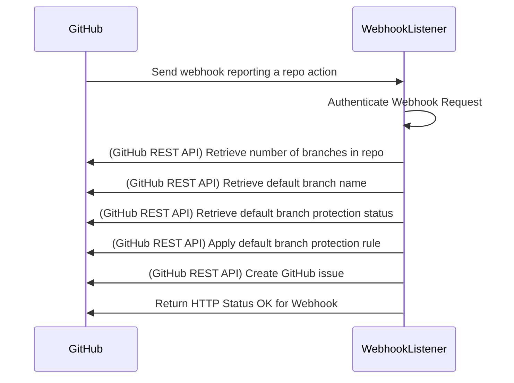

# Protect Branches

## Challenge

* We want to ensure code reviews for code added to our repositories.
* We want to accomodate this need at scale, as new respositories are created. 

## Assumptions

* New repos are created frequently and need to automatically inherit agreed policies.
* Our preferred protected branch rule is to:
    * Require a pull request before merging to the default branch.
    * Require the pull request to be approved by at least one reviewer.
* New repos will be initialized with a README at creation.
* We aren't worried about protecting the default branch for repos which are not initialized with a default branch at creation.
* We are using a single GitHub Organization.

## Desired state

* When a new repo is created:
  * The default branch is protected
  * An issue is automatically created in the repo
    * Including a @mention
    * Documenting the creation of the repo
    * Confirming the protection rule(s) applied

## Limitations of this solution
* This solution does not accomodate existing repositories. It is built to handle repositories that are newly created, with a default branch.
* This solution does not accomodate repositories that are not initialized with a default branch.

## How the solution works



When a new repository is created in GitHub, GitHub can send a notice of that event to a specfied URL. Sending that event is called a Webhook, and the URL we are sending to is called an HTTP Listener, or Webhook Listener.

In this implementation, the Webhook Listener is a Node.js application.

 To simplify operations, this implementation is running in Azure, in a serverless fashion, through what's called an Azure Function. This is a very low cost (typically free) piece of compute which can trigger only when we need it, take care of interfacing with the GitHub API, and then wait for the next time it's required, without running continuously.

 _Alternatively, this Node.js application could be run with AWS Lambda or other serverless platforms. It could also be run on a traditional server._

So, in the typical case for this scenario:
  1. A user or administrator creates a GitHub repo within the GitHub Organization -- this can be done via the GUI or programmatically -- and initializes the repository with a README file or other first commit.
  1. GitHub sends a webhook to our Webhook Listener URL with the repository creation metadata.
  1. The Webhook Listener uses the GitHub API to determine the default branch for the repo and applies branch protection rules to that branch.
  1. The Webhook Listener then further uses the GitHub API to create an Issue in the repo, describing the branch protection which was applied.
  1. The Webhook Listener then returns a Success HTTP status code to GitHub.

### Components

1. Your GitHub Organization
2. A GitHub webhook for your Organization
3. An Azure Function, to:
    * Listen for the webhook
    * Exercise the branch protection
    * Create the GitHub Issue

## Installation

### Deploy the Webhook Listener to Azure Functions

_The following assume you will host the app with Azure Functions and want to deploy through the Web UI_

#### Through the Azure Portal UI

1. Create an Azure Function
    1. From the Azure Portal, create a new Azure Function App
    1. Give it a name and select `Node.js` as the runtime stack
    1. Once the Function App resource is created, select "Create a function"
    1. From the available templates, select "HTTP trigger" and create
    * 
1. Copy the code to your Azure Function
    1. Once that is ready, go to the "Code + Test" feature
    1. Copy-and-paste the `webhooktrigger/index.js` file contents from this repository over the index.js file shown to you in the Azure Portal. Save.
    * 
1. Install the octokit Node.js package 
    1. Go to the Function App Overview page in the UI
    1. Go to Advanced Tools, under Development Tools
    1. Go to the Debug Console > PowerShell
    1. Execute command: `cd site`
    1. Execute command: `cd wwwroot`
    1. Execute command: `npm install octokit`
    * 
1. Use "Get function URL" button to retrieve the function's endpoint; you'll need this to configure the Webhook in the next set of steps
    * 
1. Go to Function Keys and copy the default secret (we'll call this our Azure Secret), which you'll also need in the next set of steps
    * 

### Set up the Webhook in Your GitHub Organization
1. Create or access your GitHub Organization
1. Go to Settings for the Organization
1. Go to Webhooks
3. Add a Webhook
    * 
    1. For payload URL, paste your Azure Function URL
    1. For content type, select `application/json`
    1. For secret, paste the Azure Secret from the previous step
    1. Select "Let me select individual events"; ensure that only the box for "Repositories" is selected
    1. Ensure the box for "Active" is selected, to enable this webhook
    1. Click Add Webhook button 

### Get a GitHub Access Token
1. In your GitHub profile settings, go to Developer Settings
1. Create a personal access token

### Set Secrets for Azure Function to Use
1. Use Azure Key Vault to set up the following three secrets:
    1. `GitHubTokenKeyVault` - this is the GitHub Personal Access Token you created
    1. `AzureFunctionSecretKeyVault` - this is the default Azure Function Function Key secret for your created Azure Function
    1. `NameToMentionKeyVault` - this is the GitHub username you want mentioned in the Issues created by this app
1. If you don't want to use Azure Key Vault and you're only using this for testing, you can set the three values as environment variables, either in the system or at the top of the `index.js` file, like this, and they will be picked up and used by the code in the same way as if you had configured the Key Vault:

```
process.env.GitHubTokenKeyVault = 'my-github-secret';
process.env.AzureFunctionSecretKeyVault = 'my-azure-secret';
process.env.NameToMentionKeyVault = 'my-user';
```

## Monitoring

You can view the logs in the Azure Functions "Monitor" portal
    * 


## Room for Enhancements
1. Deploy via Infrastructure-as-Code
1. Push a default branch when the repo is not initialized on creation
1. Configure as a GitHub App with rotating authentication
    

## References
 
1. [Microsoft Learn, Monitor GitHub events by using a webhook with Azure Functions](https://docs.microsoft.com/en-us/learn/modules/monitor-github-events-with-a-function-triggered-by-a-webhook/)
1. [Integrate Key Vault Secrets With Azure Functions](https://daniel-krzyczkowski.github.io/Integrate-Key-Vault-Secrets-With-Azure-Functions/)
1. [Octokit, Official clients for the GitHub API](https://github.com/octokit)
1. [GitHub: Managing Branch Protection Rules](https://docs.github.com/en/repositories/configuring-branches-and-merges-in-your-repository/defining-the-mergeability-of-pull-requests/managing-a-branch-protection-rule)
1. [Continuous delivery by using GitHub Actions](https://docs.microsoft.com/en-us/azure/azure-functions/functions-how-to-github-actions?tabs=javascript)
