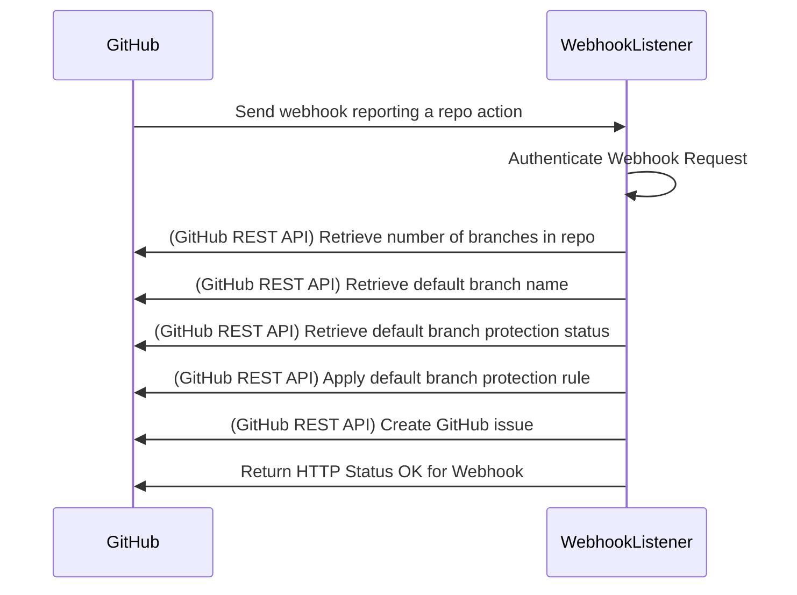

# Protect Branches

## Challenge

* We want to ensure code reviews for code added to our repositories.
* We want to accomodate this need at scale, as new respositories are created. 

## Assumptions

* New repos are created frequently and need to automatically inherit agreed policies.
* New repos will be initialized with a README at creation.
* We aren't worried about protecting the default branch for repos which are not initialized with a default branch at creation.
* We are using a single GitHub Organization.

## Desired state

* When a new repo is created:
  * The default branch is protected
  * An issue is automatically created in the repo
    * Including a @mention
    * Documenting the creation of the repo
    * Confirming the protection rule(s) applied

## Limitations of this solution
* This solution does not accomodate existing repositories. It is built to handle repositories that are newly created, with a default branch.
* This solution does not accomodate repositories that are not initialized with a default branch.

## How the solution works

When a new repository is created in GitHub, GitHub can send a notice of that event to a specfied URL. Sending that event is called a Webhook, and the URL we are sending to is called an HTTP Listener, or Webhook Listener.

In this implementation, the Webhook Listener is a NodeJS application.

 To simplify operations, this implementation is running in Azure, in a serverless fashion, through what's called an Azure Function. This is a very low cost (typically free) piece of compute which can trigger only when we need it, take care of interfacing with the GitHub API, and then wait for the next time it's required, without running continuously.

 _Alternatively, this NodeJS application could be run with AWS Lambda or other serverless platforms. It could also be run on a traditional server._

So, in the typical case for this scenario:
  1. A user or administrator creates a GitHub repo within the GitHub Organization -- this can be done via the GUI or programmatically -- and initializes the repository with a README file or other first commit.
  1. GitHub sends a webhook to our Webhook Listener URL with the repository creation metadata.
  1. The Webhook Listener uses the GitHub API to determine the default branch for the repo and applies branch protection rules to that branch.
  1. The Webhook Listener then further uses the GitHub API to create an Issue in the repo, describing the branch protection which was applied.
  1. The Webhook Listener then returns a Success HTTP status code to GitHub.

### Components

1. Your GitHub Organization
2. A GitHub webhook for your Organization
3. An Azure Function, to:
    * Listen for the webhook
    * Exercise the branch protection
    * Create the GitHub Issue

## Demonstration

## Installation

### Deploy the Webhook Listener to Azure Functions
1. Download the `.zip` of this repository and deploy to Azure Functions

### Set up the Webhook in Your GitHub Organization
1. Create or access your GitHub Organization
1. Go to Settings for the Organization
1. Go to Webhooks
1. Add a Webhook
    1. For payload URL, paste your Azure Function URL
    1. For content type, select `application/json`
    1. For secret, paste the Azure Function Keys default secret from the previous step
    1. Select "Let me select individual events"; ensure that only the box for "Repositories" is selected
    1. Ensure the box for "Active" is selected, to enable this webhook
    1. Click Add Webhook button 

### Get a GitHub Access Token
1. In your GitHub profile settings, go to Developer Settings
1. Create a personal access token

### Set Secrets for Azure Function to Use
1. Use Azure Key Vault to set up the following three secrets:
    1. `GitHubTokenKeyVault` - this is the GitHub Personal Access Token you created
    1. `AzureFunctionSecretKeyVault` - this is the default Azure Function Function Key secret for your created Azure Function
    1. `NameToMentionKeyVault` - this is the GitHub username you want mentioned in the Issues created by this app

## FAQ

1. What does it mean for a branch to be protected?

## References
 
1. [Microsoft Learn, Monitor GitHub events by using a webhook with Azure Functions](https://docs.microsoft.com/en-us/learn/modules/monitor-github-events-with-a-function-triggered-by-a-webhook/)
1. [Integrate Key Vault Secrets With Azure Functions](https://daniel-krzyczkowski.github.io/Integrate-Key-Vault-Secrets-With-Azure-Functions/)
